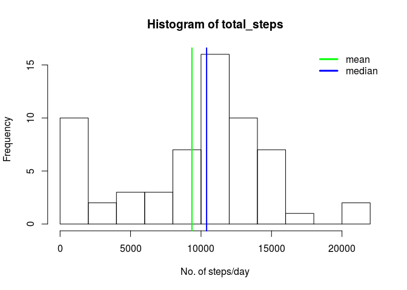
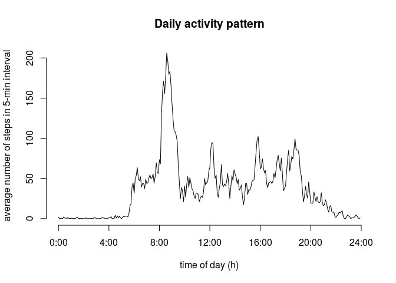

# Reproducible Research: Peer Assessment 1


## Loading and preprocessing the data
Unzip the activity.zip file and load data using read.csv.

```r
data <- read.csv(unz("activity.zip", "activity.csv"), colClasses=c("integer", "Date", "integer"))
data$interval <- 60*floor((data$interval+1)/100) + (data$interval %% 100)

str(data)
```

```
## 'data.frame':	17568 obs. of  3 variables:
##  $ steps   : int  NA NA NA NA NA NA NA NA NA NA ...
##  $ date    : Date, format: "2012-10-01" "2012-10-01" ...
##  $ interval: num  0 5 10 15 20 25 30 35 40 45 ...
```

```r
summary(data)
```

```
##      steps             date               interval     
##  Min.   :  0.00   Min.   :2012-10-01   Min.   :   0.0  
##  1st Qu.:  0.00   1st Qu.:2012-10-16   1st Qu.: 358.8  
##  Median :  0.00   Median :2012-10-31   Median : 717.5  
##  Mean   : 37.38   Mean   :2012-10-31   Mean   : 717.5  
##  3rd Qu.: 12.00   3rd Qu.:2012-11-15   3rd Qu.:1076.2  
##  Max.   :806.00   Max.   :2012-11-30   Max.   :1435.0  
##  NA's   :2304
```

## What is mean total number of steps taken per day?
Calculate the mean total steps using the *tapply* function

```r
total_steps <- tapply(data$steps, data$date, sum, na.rm=T)
mean_steps <- mean(total_steps)
mean_steps
```

```
## [1] 9354.23
```

Calculate the median 

```r
median_steps <- median(total_steps)
median_steps
```

```
## [1] 10395
```

Generate the histogram and show the mean and median in it.


```r
hist(total_steps, breaks=10, xlab="No. of steps/day")
abline(v=mean_steps, col="green", lwd=2)
abline(v=median_steps, col="blue", lwd=2)
legend(x="topright", legend=c("mean", "median"), col=c("green", "blue"), bty="n", lwd=3)
```

 


## What is the average daily activity pattern?
Plot the activity pattern as a time series.

```r
avg_steps <- tapply(data$steps, data$interval, mean, na.rm=T)

hours <- as.numeric(names(avg_steps))/60
plot(hours, avg_steps, type="l", axes=F,
     xlab="time of day (h)", ylab="average number of steps in 5-min interval",
     main="Daily activity pattern")
axis(2)
axis(1, at=0:6*4, labels=paste(0:6*4,":00", sep=""))
```

 

Find the 5 minute interval that has the maximum number of steps.

```r
max_activity_num <- which(avg_steps == max(avg_steps))
max_activity_int <- data$interval[max_activity_num]
sprintf("%02d:%02d", floor(max_activity_int/60), max_activity_int%%60)
```

```
## [1] "08:35"
```
## Imputing missing values


## Are there differences in activity patterns between weekdays and weekends?
